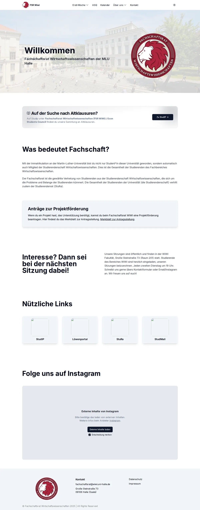
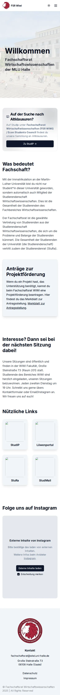
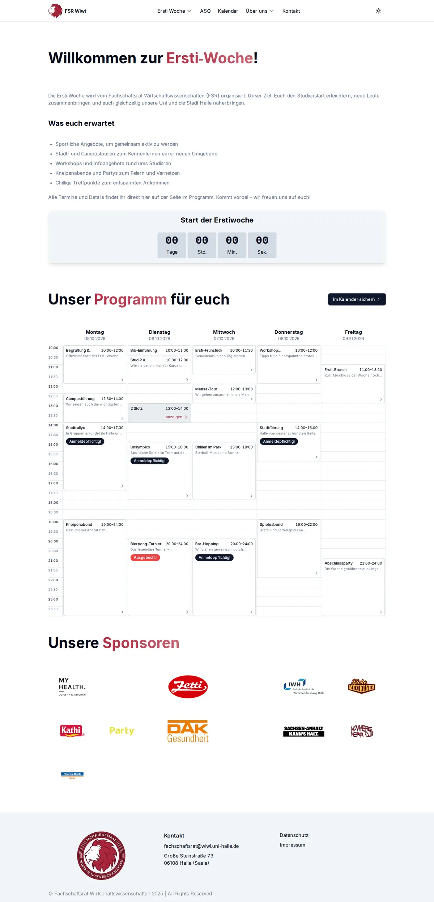
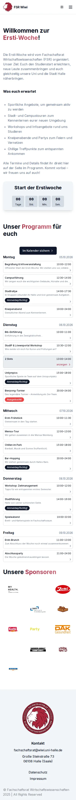
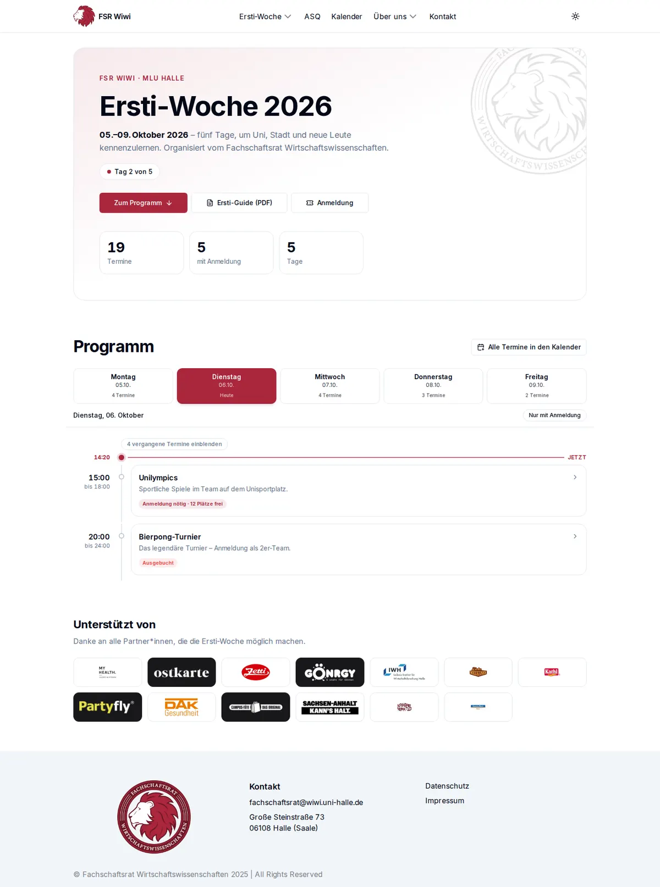
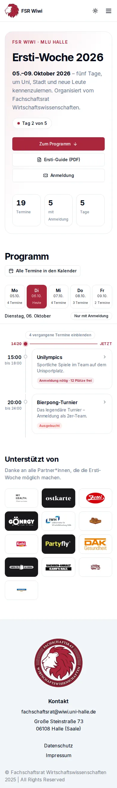
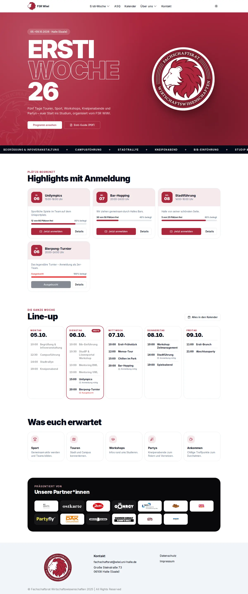
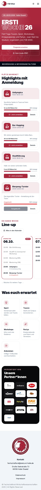
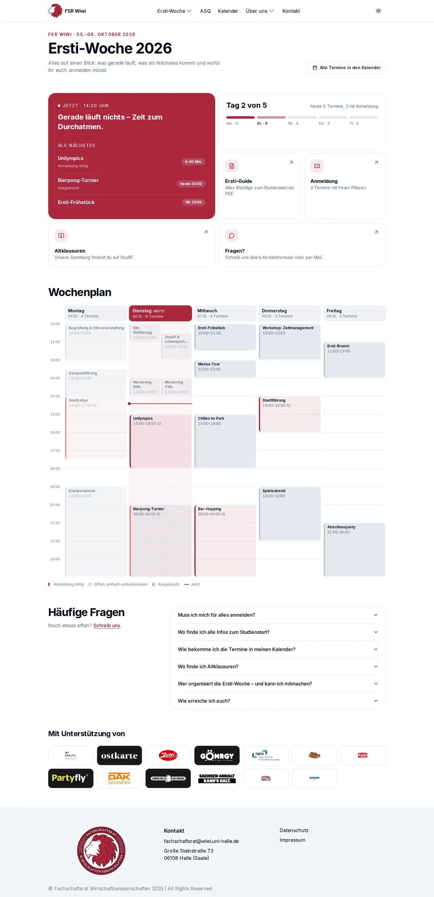
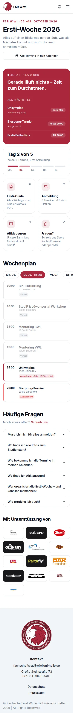

# UI/UX-Audit fsr-wiwi-halle.de

Stand: 05.10.2026 · Branch `refactor` · Fokus: Startseite und `/erstiwoche`

> **Hinweis zu den Screenshots:** Die Live-Seite und das CMS waren aus der Testumgebung nicht erreichbar. Alle Screenshots wurden lokal mit **Beispiel-Events** (fiktives Programm 05.–09.10.2026) und einer simulierten Uhrzeit (Dienstag, 06.10., 14:20) erstellt. Die echten Seiten nutzen weiterhin die CMS-Daten. Bilder, die von fremden Servern geladen werden, waren dort ebenfalls blockiert. Das erklärt die leeren Kacheln bei „Nützliche Links“, zeigt aber gleichzeitig das Problem in H5.

---

## Kurzfassung: die 5 wichtigsten Punkte

1. **Während der Erstiwoche verweist die Startseite nicht auf die Erstiwoche.** Der Hero zeigt nur ein getipptes „Willkommen“, und die vorhandene `ErstiWocheCTA` ist nicht eingebunden.
2. **Im Wochenraster überdecken sich Termine.** Termine, die sich überschneiden, aber nicht exakt gleich lang sind, werden übereinander gezeichnet (siehe Screenshot: „Bib-Einführung“ und „StudIP-Workshop“).
3. **Der Countdown hängt nach dem Start auf `00 00 00 00`** und schiebt das Programm unter den sichtbaren Bereich. Ein „Was läuft jetzt?“ fehlt.
4. **Wann und wo?** Das Datum der Woche steht nirgends prominent, Orte fehlen komplett, und der Detail-Dialog zeigt nur Uhrzeiten ohne Wochentag.
5. **Drei von dreizehn Sponsorenlogos sind unsichtbar.** Ostkarte, Goenrgy und Campus-Tüte sind weiße Logos auf weißen Kacheln, Partyfly ist kaum lesbar.

---

## Startseite (`app/(lang)/page.tsx`)

| Vorher Desktop | Vorher Mobil |
|---|---|
|  |  |

### Hoch

- **H1 – Der Hero transportiert keine Botschaft.** 66 vh Höhe für ein getipptes „Willkommen“ (Typewriter mit `repeat={2}`, dadurch springt das Layout). Es gibt keinen Call-to-Action und keinen Hinweis auf aktuelle Themen.
  → *Vorschlag:* Den Hero auf rund 40 vh verkleinern, mit einem klaren Satz („Wir sind die gewählte Vertretung aller WiWi-Studis in Halle“) und 2–3 Buttons. Saisonal sollte ein Banner erscheinen: Erstiwoche im Oktober, Klausurphase mit Altklausuren, Wahlen.
- **H2 – Kein Hinweis auf die Erstiwoche.** `components/ersti-cta.tsx` existiert (Text noch „2025“), ist aber nirgends eingebunden. Gerade jetzt ist das die wichtigste Seite.
  → *Vorschlag:* Den CTA zeitgesteuert über `ERSTI_START` aus `lib/ersti.ts` einblenden.
- **H3 – Es gibt keine semantischen Überschriften.** `Header` und `SubHeader` (`components/TextComponents.tsx`) rendern `<div>`s. Die Startseite hat kein `<h1>`. Das schadet SEO und Screenreadern.
  → *Vorschlag:* `Header` bekommt `as="h1" | "h2"` (Standard `h2`) und der Hero ein `<h1>`.
- **H4 – Der Satz bei der Projektförderung steht doppelt.** `locales/de.json → home.projectFunding.paragraph` endet bereits mit „Hier findest du das Merkblatt zur Antragsstellung.“, danach hängt `page.tsx` den Link „Merkblatt zur Antragsstellung“ noch einmal an.
- **H5 – „Nützliche Links“ laden Bilder von fremden Servern** (Wikimedia, StuRa, Löwenportal, tenfold-security.com). Das ist fragil, denn bricht ein Link, bleibt die Kachel leer. Außerdem widerspricht es der Consent-Lösung beim Instagram-Embed (die IP geht trotzdem an Dritte). Dazu kommen `` ohne `alt`, Leerzeichen in den `href`s (`"https://studip.uni-halle.de/  "`), fehlendes `target`/`rel` und ein zu aggressives `hover:scale-110`.
  → *Vorschlag:* Die Logos lokal in `public/` ablegen oder durch Icons (Lucide) ersetzen. Die Kacheln sollten kompakt sein: Icon, Name und Einzeiler, was man dort findet.

### Mittel

- **M1 – Lange Textwände.** „Was bedeutet Fachschaft?“ besteht aus zwei langen Absätzen ohne Gliederung.
  → *Vorschlag:* Drei Kacheln: „Wer wir sind“, „Was wir machen“, „Wie du mitmachst“.
- **M2 – Sitzungstermin nur als „jeden zweiten Dienstag“.** Es fehlt ein konkretes nächstes Datum und ein Kalenderlink.
  → *Vorschlag:* Den nächsten Termin aus dem CMS ziehen (Event-Tag „sitzung“).
- **M3 – Das Hero-Bild liegt teilweise unter der Navbar** (`absolute top-16` = 64 px, die Navbar ist aber 72 px hoch). Volle Breite geht nur per Hack, weil `app/layout.tsx` jede Seite in einen `WidthWrapper` (`max-w-6xl`) zwingt.
  → *Vorschlag:* Die Breite pro Seite bzw. Section steuern statt global.
- **M4 – `FadeInSection` blendet jede Section erst beim Scrollen ein.** Inhalte sind zunächst unsichtbar (`opacity: 0`). Ohne JavaScript oder bei einem JS-Fehler bleibt die Seite leer, und `prefers-reduced-motion` wird ignoriert.
- **M5 – Der Instagram-Embed ist 531 px hoch** und zeigt vor der Zustimmung eine große graue Fläche.
  → *Vorschlag:* Ein kleinerer Platzhalter mit Profil-Link als Hauptaktion.

---

## Erstiwoche (`app/(lang)/(Erstiwoche)/erstiwoche/page.tsx`)

| Vorher Desktop | Vorher Mobil |
|---|---|
|  |  |

### Hoch

- **E1 – Termine überlappen im Raster.** `components/weekgrid/weekgrid.tsx` gruppiert nur Termine mit *identischer* Start- und Endzeit. Alles andere, was sich überschneidet, wird übereinander gezeichnet, und der Inhalt ist verdeckt.
  → *Gelöst in Entwurf 3:* `layoutDay()` legt überlappende Termine nebeneinander.
- **E2 – Der Countdown hängt nach dem Start.** `components/CountDown.tsx` zeigt ab 10:00 Uhr am Montag dauerhaft `00 00 00 00`. Vor dem ersten Tick rendert er Nullen (Flash), und das Zieldatum `"2026-10-05T10:00:00"` hat keine Zeitzone, es gilt also die Ortszeit des Besuchers.
  → *Vorschlag:* Den Countdown durch einen Status ersetzen: vorher „Noch X Tage“, während der Woche „Tag 2 von 5 · Jetzt läuft …“, danach „Danke!“. So ist es in allen drei Entwürfen umgesetzt.
- **E3 – Das Wichtigste fehlt oben auf der Seite.** Es gibt kein Datum der Woche, keinen Link zum Ersti-Guide (PDF) und keinen zur Anmeldung. Das steht nur im Dropdown der Navigation. Intro-Text und Countdown schieben das Programm auf dem Handy über zwei Bildschirmhöhen nach unten.
- **E4 – Es gibt keine Orte.** Der Ort ist im Dialog auskommentiert, und `EventItem` (`app/types.d.ts`) hat kein Feld dafür, obwohl `data/locations.json` und `app/_actions/getLocations.ts` existieren. Für Erstis ist „Wo?“ die zweitwichtigste Frage.
  → *Vorschlag:* Den Ort im CMS am Event pflegen und in Karte und Dialog anzeigen, inklusive Maps-Link (`LocationCard` aus `components/Event.tsx` kann man wiederverwenden).
- **E5 – Event-Karten sind nicht per Tastatur bedienbar.** In `grid-item.tsx` ist ein `<div>` der Auslöser des Dialogs. Außerdem steht `cursor-default`, obwohl die Karte klickbar ist.
  → *Gelöst in den Entwürfen:* `EventDialog` mit `<button>` als Auslöser.

### Mittel

- **E6 – Kein „Heute“ und kein „Jetzt“.** Es gibt keine Hervorhebung des heutigen Tages, keine Jetzt-Linie, und vergangene Termine sehen aus wie kommende. Mobil wird immer die ganze Woche ab Montag gelistet.
- **E7 – Kurze Termine werden abgeschnitten.** 30 Minuten entsprechen 32 px. Titel und Beschreibung werden mit `line-clamp-1` gekürzt („Begrüßung &…“, „Workshop:…“). Die feste Breite `min-w-[900px]` erzwingt auf Tablets horizontales Scrollen.
- **E8 – „2 Slots – anzeigen“ ist unverständlich.** Niemand weiß, was ein „Slot“ ist. Gleichzeitige Termine sollten direkt nebeneinander sichtbar sein.
- **E9 – Der Dialog zeigt nur „10:00 bis 12:00“** ohne Wochentag und Datum. Der Link zur Anmeldung ist relativ (`"anmeldung/" + slug`) und funktioniert nur zufällig.
- **E10 – „Im Kalender sichern“** ist mehrdeutig, denn der Button lädt alle Termine als eine `.ics`-Datei. Die ICS-Erzeugung nutzt `getHours()` (lokale Zeit, ohne Zeitzone) und existiert dreimal (`lib/utils.ts` zweimal, `grid-item.tsx` einmal).
- **E11 – Sponsorenlogos unsichtbar.** Ostkarte, Goenrgy und Campus-Tüte sind weiße PNGs auf `bg-white/70`. Das ist für zahlende Partner*innen besonders ungünstig.
  → *Gelöst in den Entwürfen:* `onDark`-Flag in `lib/ersti.ts` sorgt für eine dunkle Kachel.

### Niedrig

- Die Metadaten lauten noch „Alles über die Ersti-Woche 2025“ (ebenso `/anmeldung` und `ersti-cta.tsx`).
- Toter Code in `page.tsx`: `groupEventsByDay`, das ungenutzte `offers`-Array und der Import `SponsorOfferGrid`.
- Die Überschrift „Unser Programm für euch“ hat dieselbe Riesengröße (`text-5xl`, `py-16`) wie die Seitenüberschrift. Dadurch gibt es kaum Hierarchie.

---

## Seitenübergreifend

- **G1 – Die Markenfarbe kommt kaum vor.** `--primary` ist das shadcn-Standard-Slate, deshalb sind alle Buttons fast schwarz. Bordeaux taucht nur im Text-Gradient auf. `colors.css` (FSR-Palette) wird nirgends importiert.
  → *Vorschlag:* `--primary` auf FSR-Bordeaux setzen und `colors.css` löschen. Vorbereitet ist schon `fsr-deep` (siehe unten).
- **G2 – Die Navbar ist nicht barrierefrei.** Das Desktop-Dropdown öffnet nur per Hover (nicht per Tastatur oder Touch). Das mobile Menü hat keinen Schließen-Button, kein `aria-expanded` und keinen Fokus-Trap. Die Klasse `bg-${active ? …}` wird dynamisch gebaut, was Tailwind nicht zuverlässig erkennt. Das Logo-`` hat kein `alt`.
  → *Vorschlag:* `DropdownMenu` (Radix ist schon installiert) und `Drawer`/`vaul` für das mobile Menü nutzen.
- **G3 – Footer.** „© … 2025“ ist fest eingetragen, Deutsch und Englisch sind gemischt („All Rights Reserved“), es fehlen ein Instagram-Link und ein Link zu den Sitzungen. Das Logo hat kein `alt`.
- **G4 – Zu viel Leerraum.** `Header` hat `py-8 md:py-16`, und dazu kommen `gap-16` im Layout und `mb-16` an Cards. Die Seiten wirken dadurch auseinandergezogen.
- **G5 – Die 404-Seite ist englisch und deutsch gemischt.** Ein `<Link>` liegt in einem `<Button>` (verschachtelte interaktive Elemente).
- **G6 – Technik.** `bun run lint` ist schon auf `main` kaputt (ESLint-Konfiguration: „Converting circular structure to JSON“). Die README ist noch die Create-Next-App-Vorlage. In `TextComponents.tsx` importiert eine Client-Komponente `setTimeout` aus `"timers/promises"` (Node-Modul, ungenutzt).

---

## Die drei Entwürfe für `/erstiwoche`

Alle drei laden die Daten genau wie die echte Seite (`getEvents({ tag: ERSTI_TAG })`), sind per `noindex` vor Suchmaschinen versteckt und stehen nicht in der Sitemap. Sie verwenden nur Inhalte, die es schon gibt. Gemeinsame Bausteine liegen in `app/(lang)/(Erstiwoche)/_designs/`.

Gemeinsam haben alle drei:

- einen Status statt Countdown (vorher, während, nachher),
- Hervorhebung von „Heute“ und „Jetzt“, vergangene Termine abgeblendet,
- einen einheitlichen Status: „Anmeldung nötig · 12 Plätze frei“, „Ausgebucht“, „Läuft gerade“,
- einen tastaturbedienbaren Dialog mit Wochentag, Datum und Zeit, „In meinen Kalender“ und absolutem Anmelde-Link,
- Ersti-Guide und Anmeldung direkt oben verlinkt,
- Sponsorenlogos, die auch als weiße Logos lesbar sind.

> **Zum Testen anderer Zeitpunkte:** `?now=` an die URL hängen, z. B. `/erstiwoche-3?now=2026-10-06T14:20` (während der Woche), `?now=2026-09-28T12:00` (vorher) oder `?now=2026-10-12T12:00` (danach).

### Entwurf 1 – „Agenda“ · `/erstiwoche-1`

Funktional und für Handys gedacht. Kompakter Hero mit Datum, Kennzahlen und drei Buttons. Darunter eine **feste Tagesleiste (Mo–Fr)**, in der der heutige Tag automatisch ausgewählt ist. Die Termine stehen als **vertikale Timeline mit Jetzt-Linie**. Vergangene Termine des Tages werden eingeklappt, und es gibt einen Filter „Nur mit Anmeldung“.

- **Pro:** Man ist am schnellsten bei „Was kommt heute?“, es ist sehr gut lesbar und am wenigsten Code.
- **Contra:** Keine Wochenübersicht auf einen Blick, optisch eher zurückhaltend.

| Desktop | Mobil |
|---|---|
|  |  |

### Entwurf 2 – „Festival-Poster“ · `/erstiwoche-2`

Emotional und stark in der Marke. **Hero in Bordeaux über die volle Breite** mit großer Schrift „ERSTI WOCHE 26“ und darunter ein Laufband mit allen Programmpunkten. Es folgen **Highlight-Karten** für Termine mit Anmeldung (mit Platz-Balken „12 von 60 frei“), ein **„Line-up“** mit fünf Tageskarten (mobil wischbar, startet beim heutigen Tag), „Was euch erwartet“ als Icon-Kacheln und ein dunkles Sponsoren-Band.

- **Pro:** Macht Lust auf die Woche, die Anmelde-Termine stehen im Vordergrund (Plätze), und Sponsoren werden schön präsentiert.
- **Contra:** Mehr Scrollen bis zum Programm, und das Laufband ist Geschmackssache.

| Desktop | Mobil |
|---|---|
|  |  |

### Entwurf 3 – „Dashboard“ · `/erstiwoche-3`

Alles auf einen Blick, im Bento-Layout. Eine große Kachel **„Jetzt / Als Nächstes“** (live, mit Fortschrittsbalken und „in 40 Min.“), ein Wochenfortschritt sowie Kacheln für Ersti-Guide, Anmeldung, Altklausuren und Kontakt. Darunter ein **verbessertes Wochenraster**: Überlappungen liegen nebeneinander, die Zeitachse passt sich automatisch an, die heutige Spalte und eine Jetzt-Linie sind hervorgehoben, Farben zeigen die Anmeldepflicht und eine Legende erklärt sie. Am Ende ein **FAQ-Akkordeon**, nur mit Antworten, die belegbar sind.

- **Pro:** Löst alle Probleme des aktuellen Rasters, ist während der Woche am nützlichsten, und die FAQ nimmt Fragen per Mail ab.
- **Contra:** Am komplexesten, und das Raster ist erst ab Tablet-Breite sinnvoll (mobil gibt es eine Liste).

| Desktop | Mobil |
|---|---|
|  |  |

### Empfehlung

Als Basis **Entwurf 3** nehmen, mobil die Timeline aus **Entwurf 1** verwenden (mit eingeklappten vergangenen Terminen und Jetzt-Linie) und daraus übernehmen: den **Hero** und die **Highlight-Karten mit Platz-Balken** aus Entwurf 2. Danach den Ort pro Event im CMS ergänzen (E4).

---

## Änderungen an bestehendem Code in diesem Branch

Die Live-Seiten sehen unverändert aus. Nur diese kleinen Grundlagen wurden angepasst:

- `lib/ersti.ts` (neu): `ERSTI_TAG`, `ERSTI_START`, `ERSTI_GUIDE` und die Sponsorenliste (inklusive `onDark`). `erstiwoche/page.tsx` nutzt sie statt der festen Werte.
- `app/globals.css`: `--fsr1` und `--fsr2` sind jetzt leerzeichengetrennt (`350 63% 41%`), damit Tailwind-Deckkraft wie `bg-fsr/10` funktioniert. Die Darstellung ist identisch.
- `tailwind.config.ts`: `fsr` mit `<alpha-value>` und eine neue Farbe `fsr-deep` (Bordeaux unabhängig vom Theme, für Flächen mit weißer Schrift).
- `next-sitemap.config.js`: `/erstiwoche-*` ausgeschlossen.

## Lokal ansehen

```bash
bun install
# .env mit CMS_ENDPOINT und CMS_TOKEN wie in Produktion
bun dev
# http://localhost:3000/erstiwoche-1  …-2  …-3
```
